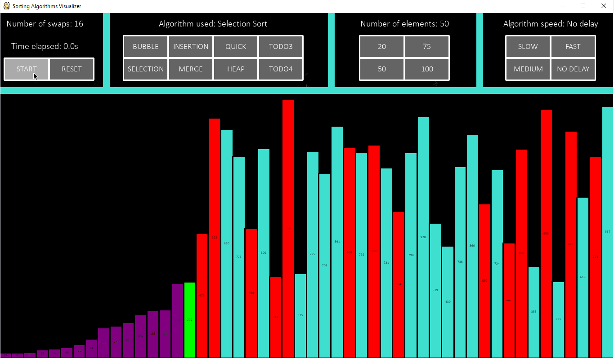

# Sorting Algorithms Visualizer

A python/pygame application to visualize various sorting algorithms.

## Application Functionality

Users can choose from one of the seven provided sorting algorithms for visualization, and can also customize the number of elements sorted and the speed at which the visualization runs. After selecting all the necessary parameters, the user can choose to start the algorithm visualization. After the algorithm is complete, the user has the option to reset the application so that different parameters can be selected for testing.

<!-- <table>
  <tr>
    <td></td>
    <td></td>
    <td></td>
  </tr>
</table> -->

## Implemented Algorithms:

-   Bubble Sort
-   Insertion Sort
-   Selection Sort
-   Merge Sort
-   Quick Sort
-   Heap Sort
-   Radix Sort

## Built With:

-   Python
-   Pygame
